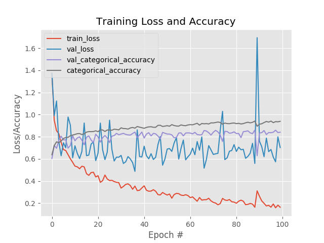
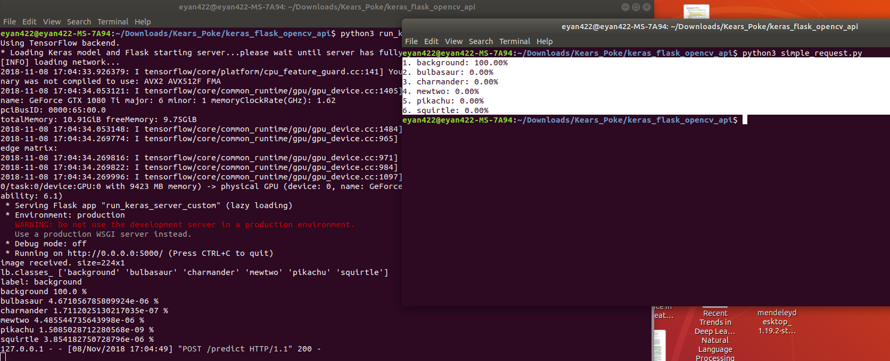

# Deeplearning-Image-Classification-Prototype-System

Keras + Deeplearning + flask REST API + opencv full example

## Getting started
$ pip install requests

$ pip install opencv-python

$ pip install flask  

$ pip install gevent

$ pip install requests

$ pip install keras

$ pip install tensorflow

$ pip install -U scikit-learn

$ pip install numpy

$ pip install matplotlib

$ pip install imutils

## Download the code
$ git clone https://github.com/frankie-yanfeng/Deeplearning-Image-Classification-Prototype-System.git

## Dataset:
The dataset is pikachu cartoon pictures which are collected by running below script:

$ python3 ./search_bing_api.py -q your_Interested_Category -o file_Saved_Path

e.g.
$ sudo python3 ./search_bing_api.py -q room -o ./Dataset/background

And before running, you will need to put in your own microsoft cognitive images search API KEY:

API_KEY = "XXXXXXXXXXXXXXXX"

For this project, below categories are created and collected. The first five ones are cartoon pictures,
while last one is indoor room pictures which are taken as background for unknown objects 

bulbasaur

charmander

mewtwo

pikachu

squirtle

background

The full dataset is download from below:
https://drive.google.com/file/d/12pM8Tz3G3AvDoMM4V0wXDZrAlxwBeG3E/view?usp=sharing

## Model definition
The architecture is defined in dnn_network/smallervggnet.py

## Training model
$ python3 train.py -d ./pikachu_Dataset -m pikachu_trained_model.model -l labelbin.pickle -p plotPic.png

plotPic.png shows the whole learning process:

## Pretrained model
The pretrained model is download from below:
https://drive.google.com/file/d/1sWLOTxCm9HQF8nTlSVlANge1h63vKtfJ/view?usp=sharing

## Verifying model
$ python3 classify.py -m pikachu_trained_model.model -l labelbin.pickle -i ./test/background1.jpg

$ python3 classify.py -m pikachu_trained_model.model -l labelbin.pickle -i ./test/background2.jpg

## Running flask server and client
$ cd keras_flask_opencv_api

$ python3 run_keras_server_custom.py

$ python3 simple_request.py

Since the image is opened by opencv, please use the simple_request.py as the client for sending pictures instead of curl and any other tool.

## Future extension
Adding message broker like redis and celery

Adding more robust image processing
